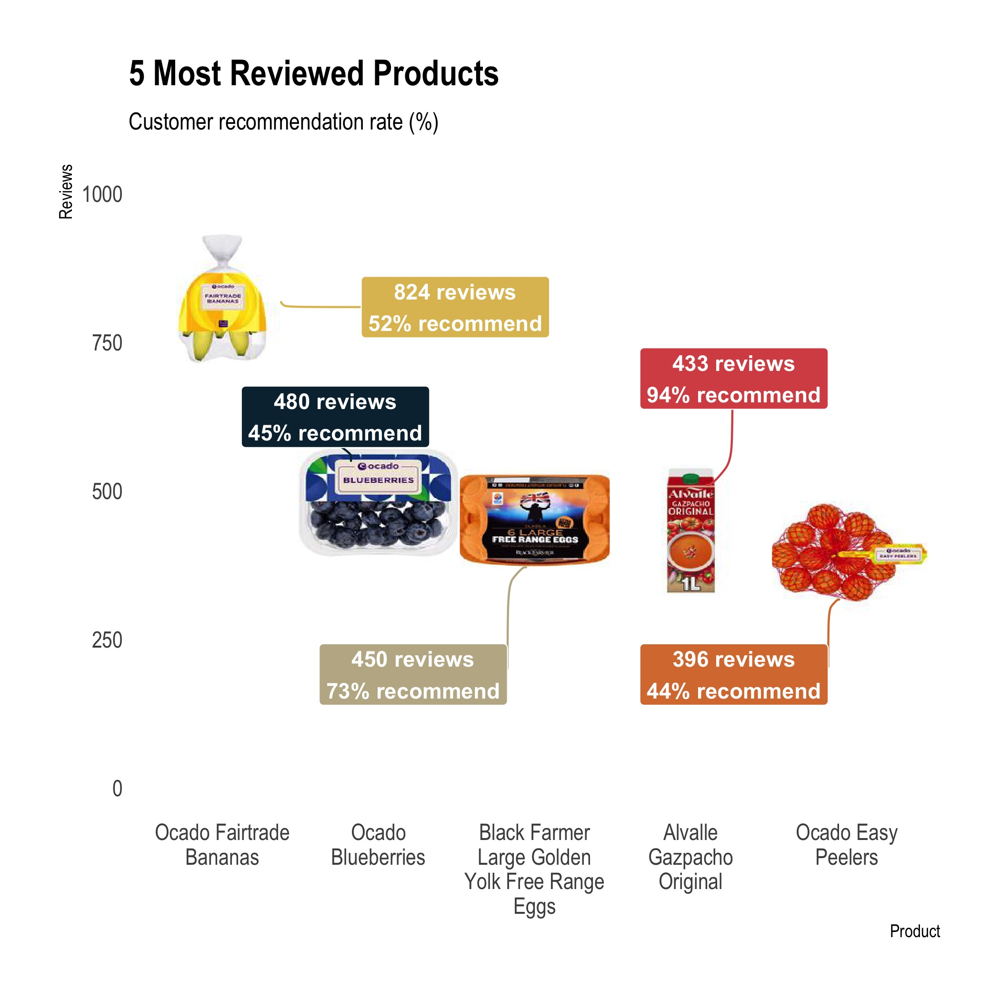

# grocerycart 

This package was built as a means to organize the scraping & cleaning functions that were created to collect data from 2 online grocery services' websites to be analyzed for the [grocery Shiny app dashboard](https://github.com/moamiristat/grocery). Since then, it has evolved to include 16 different ready to use grocery related datasets that include product details, store information and even randomly generated customers/orders/baskets database for a fake grocery store.

Thus, the goal of the `grocerycart` package is to provide:  
- **A suite of collection functions** that scrape data from 2 online grocery services: [elGrocer](https://www.elgrocer.com) & [Ocado](https://www.ocado.com).  
- **Cleaning functions** to prepare the scraped data for analysis.  
- **Datasets containing details from real grocery stores** (e.g., products, prices, reviews).  
- **Ready to use grocery data**: customer, order and basket datasets generated using real products. You can also generate your own grocery data.

## Installation
```
# install from GitHub (make sure to set build_vignettes = TRUE to access vignette)
install.packages("devtools")
devtools::install_github("moamiristat/grocerycart", build_vignettes = TRUE)
```

## Usage
You may want to use this package for 1 of 2 reasons:  
- Use the available grocery datasets to conduct your analysis (i.e., create graphs, analyze text review, conduct market basket analysis, build a dashboard, generate downloadable reports).   
- Scrape and clean data from the 2 online grocery services' websites - [elGrocer](https://www.elgrocer.com) & [Ocado](https://www.ocado.com).

## Getting Started & Workflow
Learn how you can scrape, clean and analyze grocery data with the functions in this package via `vignette("grocerycart")`.

## Data
You can view all 16 available datasets via `data(package = "grocerycart")`. Get more info about each dataset via `?*DatasetNAME*`.

## Analysis
Here are examples of visualizations that can be created using the dataset in this package:

 


## Related Project
Visit the [grocery project's Github](https://github.com/moamiristat/grocery) to access the grocery dashboard. 
